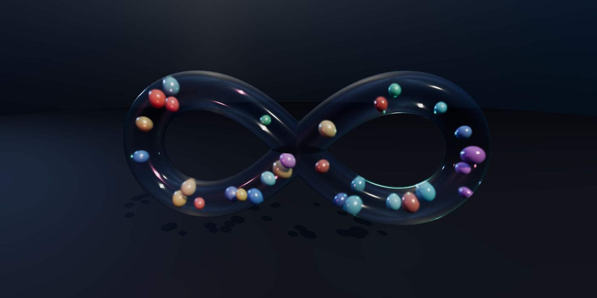

# Infinity Spheres ∞

[](https://github.com/Danielededo/infinity-spheres/actions/workflows/ci.yml)
[](https://github.com/Danielededo/infinity-spheres/actions/workflows/deploy.yml)
[](LICENSE)
[](https://threejs.org/)

A [Three.js](https://threejs.org/) scene in a **single `index.html`**: a closed **glass tube swept
along a self-intersecting curve**, with marbles of different colours and shades loose inside it — 30
of them by default, and anywhere from 2 to 40.
The marbles fly freely in 3D, bounce elastically off each other and off the inner wall of the tube,
and pass through the open junctions where the tube crosses itself.

The default spine is a Bernoulli lemniscate — one crossing, the ∞ of the title — and two other
spines with three crossings each are available at runtime. None of the physics changes with the
curve; see [Other spines](#other-spines).

**▶ Live demo: https://danielededo.github.io/infinity-spheres/**

[](https://danielededo.github.io/infinity-spheres/)

No build step and nothing to install — Three.js is loaded from a CDN through an `importmap`.

---

## How it works

### The spine

The tube is a circle of radius `R = 2.4` swept along a closed curve in the XY plane. By default that
curve is a Bernoulli lemniscate:

```
x(t) = a·cos t / (1 + sin²t)
y(t) = a·sin t·cos t / (1 + sin²t)
z(t) = 0
```

with `t ∈ [0, 2π)` and `a = 20`. Every spine is a `THREE.Curve` subclass with
`arcLengthDivisions = 4000`, so `getPointAt(u)` is arc-length based — the same parametrisation
`TubeGeometry` uses internally, which keeps the mesh and the collision surface in agreement. This
one is **104.88 units** long; the others are 155.0 and 170.2.

The curve genuinely self-intersects — the lemniscate at the origin, at `t = π/2` and `t = 3π/2` —
and that is the point: the branches merge into an open junction the marbles fly through. Everything
downstream is resampled when the spine changes, so nothing below is specific to the lemniscate
except the numbers, which are quoted for it.

### The solid

`TubeGeometry(curve, 125, R, 56, true)` gives the closed tube, 14 000 triangles. Its material is glass —
`MeshPhysicalMaterial` with `transmission: 1`, low `roughness`, `ior: 1.5`, `attenuationColor` and
`side: THREE.DoubleSide` — so you can see the marbles inside, refracted through the wall.

**Opening the junction.** Where two branches overlap, each one's wall runs straight through the
inside of the other, which would leave a pane of glass across the marbles' path. Those faces have to
go, and the boundary of what goes matters: it is the curve where the two tubes intersect.

A triangle wholly inside the other branch is dropped. A triangle that *straddles* the boundary is
**clipped** — a signed distance field is evaluated at its three vertices, and where the sign changes
the triangle is split along that surface, keeping the outside part with position, normal and uv
interpolated. The crossing point starts from the linear guess and is then bisected eight times
against the real field, because linear interpolation across an edge this long is only first-order and
left the aperture 3.1% short. On the lemniscate: 588 triangles dropped, 480 clipped.

Clipping rather than dropping matters because the alternative was visible. Deciding per whole
triangle means the cut can only follow triangle edges, and neighbouring triangles land either side
of the true curve — a sawtooth about one ring deep, and the rings are `104.88 / 125 = 0.84` units
apart on the lemniscate. It was plainly visible at the junction.

Correctness is checked by convergence of the removed area rather than against a single figure:

| tubular segments | removed area | vs converged |
| --- | --- | --- |
| 125 | 91.568 | −0.6% |
| 250 | 91.845 | −0.3% |
| 500 | 91.997 | −0.15% |
| 1000 | 92.089 | −0.03% |
| 2000 | 92.111 | — |

It converges to 92.11. The lemniscate's tangents at the node are at ±45°, so the branches cross at
exactly 90°, and for two perpendicular cylinders of equal radius the wall area of each lying inside
the other is the Steinmetz result `8R²` — `16R² = 92.16` for both branches, a 0.05% match.

Worth recording: the drop-whole-triangle method scored *better* on total removed area — 92.31 at 125
segments, +0.2% against the converged value — while looking worse. Dropping whole triangles put the
boundary up to a full triangle either side of the true curve and the errors cancelled in the
aggregate. An area check cannot see this defect; only looking at the picture could.

Only spine samples close enough to a distant part of the curve for the tubes to overlap at all are
considered, so the trim touches a few thousand faces rather than scanning all 14 000 against every
sample. That share rises with the number of junctions — 23% of samples on the lemniscate, about 45%
on the three-junction spines — so switching spine costs a visible moment on a slow machine.

### The physics

Each marble is a free body with a position and a 3D velocity — no constraint to the curve, it just
happens to be trapped in a tube.

**Marble against marble** is an elastic impulse along the line of centres, with mass proportional to
volume (`m ∝ r³`):

```
j = −(1 + e)·(v_rel · n) / (1/m₁ + 1/m₂)
v₁ −= (j/m₁)·n        v₂ += (j/m₂)·n
```

applied only when the pair is actually closing in, followed by a positional split weighted inversely
by mass.

**Marble against the wall.** The tube is the set of all points within `R` of the spine, so a marble
of radius `r` is inside exactly while its centre is within `R − r` of the spine. Each step finds the
nearest point `q` on the spine; if `d = |centre − q| > R − r`, the velocity is mirrored about the
radial normal `n = (centre − q)/d` and the centre is placed back exactly on the limit surface:

```
v −= (1 + e)·(v · n)·n
centre = q + n·(R − r)
```

Taking the minimum distance over the **whole** curve is what makes the junction work: the tube is a
*union* of disks, so a point counts as inside when it is close to any part of the spine. At a
crossing that union is an X-shaped chamber, and the same wall code that keeps marbles in the tube
lets them pass between branches with no special case. This is also why a new spine needs no new
physics — nothing here knows which curve it is.

The nearest point comes from a polyline of evenly spaced samples — 300 on the lemniscate, 443 and 487
on the longer spines — then a projection onto the two chords touching the winning sample, which turns
the sampling error from `O(step)` into `O(step²·curvature)`. Brute force for 30 marbles costs about
0.16 ms per step, so there is no spatial index.

That last figure was 0.10 ms before the spine became switchable, and the 60% is worth naming rather
than hiding. With a fixed curve the sample count was a compile-time constant and the engine could
unroll the loop against it; as a value a spine change can alter, it cannot. Freezing the count back
recovers most of the gap (0.81 µs per call against 1.11, from a 0.73 baseline). Getting it properly
would mean generating a specialised copy of the loop per curve at run time, which is not a trade
worth making here. In proportion it is 0.6% of a 60fps frame budget against 1.0%.

**Sub-steps.** Elastic impacts between unequal masses hand a lot of speed to the light marbles — they
pass 39 units/s. Each frame is split so that no marble moves more than `0.45·rMin` per sub-step,
otherwise a fast pair would swap places instead of colliding.

### What was verified

The page exposes `window.__scene` (the curve, the marbles, `nearestOnSpine`, `step`, `totalEnergy`,
the renderer and camera, and the spine-derived values as getters) so the simulation can be audited
from the outside without waiting on the renderer. Driving its own `step()` for 90 simulated seconds,
checking after every frame:

| Check | Result |
| --- | --- |
| Marble outside the glass | worst excursion `1.8e-15` — never |
| Marbles crossing between branches | 155–188, five runs |
| Total energy, `restitution = 1` | drift 0.000000% |
| Allocation per step | 0 |
| Physics cost | 0.16 ms/step |

Containment is re-checked **per spine**, not only on the default one — see
[Other spines](#other-spines) for all three.

The crossing count is the one figure here that moves between runs, and it is worth saying why rather
than quoting an average. The harness pauses the page and then drives `step()` itself, but the page has
already been running on wall-clock deltas for however long the load took, so the state the count starts
from depends on how many real frames fitted into that moment. Five runs of identical code gave 155, 159,
170, 179 and 188. That is why the gate is a floor — 120 — and not an equality: what it asserts is that
marbles still pass between the branches in quantity, which is the thing that would go to zero if a
junction ever sealed. The other four rows are exact and repeat to the digit.

Loading the page with `#s=0` removes the variance entirely — the time scale starts at zero, so nothing
advances until the measurement asks it to — which is how the per-spine table below gets identical
numbers across runs and how `npm run preview` produces identical bytes. Teaching the harness the same
trick would tighten `LOBE_CHANGES` from a floor into an equality, and is the obvious next change to it.

One known approximation, measured: `TubeGeometry` is a 56-gon inscribed in the true cylinder, so its
flat faces sit at `2.3962` instead of `2.4`. A marble pressed against the analytic wall can therefore
poke through the drawn wall by up to `0.0038` units — 0.7% of the smallest marble radius.

There used to be a second entry here, claiming the trimmed junction rim was stepped at the scale of
one face but "reads clean at normal viewing distance". It did not. The steps were obvious, someone
looking at the scene said so, and the junction is clipped rather than dropped now. Documenting a
defect as acceptable is a good way to stop looking at it.

### Rendering

- Equirectangular environment **generated at runtime** on a `<canvas>` (gradient plus soft light
  blobs) and prefiltered with `PMREMGenerator`: glass and polished marbles get something to reflect
  and refract without downloading an HDRI.
- **Six hues, not the whole wheel.** The hues used to be `i/n`, an even sweep of the colour circle.
  Thirty marbles spaced evenly around it read as a test pattern: every hue present, none chosen, and
  the muddy yellow-greens between the good colours getting equal billing. There are six now — coral,
  amber, jade, cyan, deep blue, violet — unevenly spaced, each with its own saturation and lightness
  window, because what looks right varies with hue: the amber has to be brighter and more saturated
  than the deep blue to read as the same weight against a dark ground. Each is jittered slightly so
  two marbles of one hue are not identical.
- The swatch is **hashed from the marble index**, not cycled. Marbles are seeded evenly along the
  spine by index, so `i % 6` would put the same colour at the same spacing all the way round — six
  colours in strict rotation, which looks mechanical and breaks when the count is not a multiple of
  six. The hash costs no random draw, so the arrangement and the velocities are bit-for-bit what they
  were and only the colours moved.
- `metalness`, `roughness`, `clearcoat` and `clearcoatRoughness` are varied per marble as well.
- **All the marbles are one `InstancedMesh`.** Thirty separate meshes cost thirty draw calls in the
  colour pass, thirty more filling the shadow map, and thirty more again in the extra pass the
  glass's transmission forces — which is where nearly all of the frame's draw calls were going. An
  `InstancedMesh` carries one material, though, and these marbles differ in finish as well as in
  colour: colour rides along per-instance for free (`instanceColor`), and the other four values go in
  as an instanced `vec4` patched into the standard physical shader with `onBeforeCompile`. So it is
  still the picture that was there before, not forty identically polished balls — and the SSIM gate
  is what keeps that claim honest. Measured: 67 draw calls down to **9**, and the frame time on the
  CPU rasteriser the harness runs on down by 65%.
- Key light with `PCFSoft` shadows, rim light, two coloured point lights, exponential fog,
  `ACESFilmicToneMapping`, pixel ratio capped at 2.
- A **quality switch** (**Quality** / <kbd>Q</kbd>) trades the two things that cost the most on a
  weak GPU: *fast* drops the pixel ratio to 1 and turns the shadow map off, *high* restores both.
  It defaults to *fast* on a coarse pointer — a phone — and to *high* elsewhere, and it is the one
  setting always written into the URL hash, because a link that left it out would not reproduce on
  another machine.
- `OrbitControls` with damping and a slow auto-orbit.

## Controls

| Action | Mouse / touch | Keyboard |
| --- | --- | --- |
| Orbit | drag | — |
| Zoom | scroll / pinch | — |
| Pan | right-drag / two fingers | — |
| Pause | **Pause** | <kbd>space</kbd> |
| Glass → X-ray → hidden | **Glass** | <kbd>G</kbd> |
| Gravity | **Gravity** | <kbd>V</kbd> |
| Trails | **Trails** | <kbd>T</kbd> |
| Auto-orbit | **Spin** | <kbd>A</kbd> |
| Reset (new colours and velocities) | **Reset** | <kbd>R</kbd> |
| Ride the selected marble | **Ride a marble** | <kbd>F</kbd> |
| Quality: high ⇄ fast | **Quality** | <kbd>Q</kbd> |
| Inspect a marble | click it | — |
| Fold the panel away | **▲ / ▼** | <kbd>M</kbd> |
| Show/hide the HUD | — | <kbd>H</kbd> |

Four sliders: **Speed** scales time from 0 to 3×, **Marbles** from 2 to 40, **Size** scales the radius
range from 0.5× to 1.4×, and **Elastic** sets the restitution from 0.8 to 1. Changing the count or the
size rebuilds the marbles; the other two take effect live.

Under **more**: four presets (*Default*, *One heavy*, *Swarm*, *Marble run*), three of the four camera
poses the benchmark uses — the fourth sits close inside the junction and is there to be a hard case for
the gate, not a nice view — a PNG export, and **Copy link**.

### Other spines

Under **more → spine** the tube can be swept along a different closed curve. The physics does not care
which: containment is "the marble's centre stays within `R - r` of the nearest point on the spine", and
the junction trim finds crossings by searching the spine for branches that come within `2R` of each
other at distant arc positions. Both are curve-agnostic, so a new spine needs no new physics.

| spine | crossings | angle | length | tightest bend | capacity |
| --- | --- | --- | --- | --- | --- |
| Lemniscate | 1 | 90° | 104.9 | 2.78 R | 45 |
| Trefoil | 3 | 75.6° | 170.2 | 2.78 R | 74 |
| Clover | 3 | 86.6° | 155.0 | 1.90 R | 67 |

All three are scaled to the same bounding radius, so the camera framing does not change between them.
Measured with the harness's own gate loop — 90 simulated seconds, three runs per spine, containment
re-checked every frame:

| spine | crossings | escapes | worst excursion | energy drift |
| --- | --- | --- | --- | --- |
| Lemniscate | 154 | 0 | `1.78e-15` | 0.000000% |
| Trefoil | 289 | 0 | `1.78e-15` | 0.000000% |
| Clover | 286 | 0 | `2.00e-15` | 0.000000% |

Three runs per spine, and every column repeated exactly — the page is loaded with `#s=0` so its own
animation loop cannot advance the simulation before the measurement starts, which is what makes the
crossing count reproducible here and not in the harness. The excursions are floating-point noise at the
scale of the coordinates, not near-misses. Crossings run about 1.9 times higher on the three-junction
spines, which is the number that matters: marbles really do pass through the new junctions rather than
getting wedged in them, and a junction that had silently sealed would show up here as a collapse, not a
wobble.

Most candidate curves fail, and it is worth knowing why:

- **A 3D trefoil knot never self-intersects.** Its closest approach between distant arc positions is
  8.10 against `2R = 4.8`, so the trim finds nothing to open and you get a sealed glass knot.
- **The glass and the marbles need different depths.** The trim cuts a hole once branches are within
  `2R = 4.8`; a marble only fits through once they are within `2(R - r)`, which is 2.50 for the largest.
  In between you get a visible aperture with an invisible wall behind it.
- **The tightest bend must stay wider than the bore.** Every Lissajous curve tried failed here (bend
  radius 1.33, 0.83, 0.21 against `R = 2.4`) — the tube pinches shut at the bend. So did the 3-petal
  rose, at 2.00.
- **Branches must cross, not merge.** The 4-petal rose has pairs meeting at 0° — collinear through the
  origin, staying within `2R` for about 20 units of arc — so the trim would delete a long slot rather
  than cut an X.

`#c=trefoil` or `#c=clover` in the URL selects one.

### Riding a marble

Click any marble to select it — the raycast only tests the marbles, so the glass does not shield them
and you can pick one you can see *through* the tube. The panel then shows its radius, mass and current
speed, and a soft ring marks it in the scene.

**Ride a marble** puts the camera behind the selected one and points it down the tube. It follows a
smoothed heading rather than anchoring to the spine: anchoring means reading the nearest point on the
curve, and at the crossing the nearest branch flips, which would throw the view sideways at exactly the
interesting moment. The spine is still used, but only as a clamp — if the smoothing would push the eye
through the glass it gets pulled back toward whichever branch is nearest, and nearest is always inward.
Measured over a settled run: the eye stays 0.66 to 1.69 units from the spine, inside the 1.90 the clamp
allows, against a bore radius of 2.4.

`#f=1` in the URL arrives already riding.

### On a phone

The panel is a bottom bar within thumb reach and it **starts folded**, so opening the page gives you
the scene rather than a screen of controls. Tapping **▼** unfolds it; it scrolls internally when the
window is too short for every control, and buttons and sliders get 40px touch targets. The same fold
button appears on a desktop, where the panel starts open.

The camera also re-frames itself on a portrait window. Held upright, a phone's *horizontal* field of
view is the tight one and the lobes fall outside it — so the camera pulls back to fit the figure
vertically with margin, 66 units on a 390×844 phone against 50 in landscape. It does not pull back far
enough to fit the lobes horizontally: that needs 111 units, and `FogExp2` at that depth has taken 59%
of the image. Rotating the device re-frames, unless you have moved the camera yourself.

A reduced-motion preference (`prefers-reduced-motion`) starts with **Spin** off — the idle orbit is the
only thing here that moves without being asked — and drops the panel transitions. It is deliberately
not part of the URL hash, so a shared link cannot override the setting you chose in your own OS.

### If the CDN is unreachable

The page is one file that fetches `three@0.169.0` at runtime, so a blocked CDN used to mean a black
screen with nothing to explain it. There is now a loading card from the first paint, and after 12
seconds without the module it says what failed and what it was trying to fetch.

### The energy readout

The panel shows total energy, kinetic plus gravitational. It is the number worth watching: at the
default settings it does not move at all, however many thousands of impacts have accumulated, because
the collisions are exactly elastic. Two things make it fall, and it reports both rather than hiding
them:

- **Elastic below 1** — by construction. That is what restitution means.
- **Gravity on** — about 22% over 90 simulated seconds, and *not* because of the integrator. The
  contact model puts a marble back exactly on the limit surface, and that projection is energetically
  free only when there is no potential; with gravity it quietly changes `mgh` on every one of thousands
  of wall contacts. Accounting for the work that projection does needs a considerably more elaborate
  solver than a toggle justifies, so the drift is measured and displayed instead. At zero g the same
  code holds total energy to **0.000000%** over the same 90 seconds.

### Sharing a setup

Every control is encoded in the URL hash, so **Copy link** produces a link that restores the exact
configuration — for example `#n=18&z=1.1&e=0.92&g=1` is the marble-run preset. No hash means the
defaults, which is also what the reference screenshots in `bench/ref` were taken of.

## Running it locally

The file uses ES modules, so it has to be served over HTTP — opening it as `file://` breaks the
module imports:

```bash
git clone https://github.com/danielededo/infinity-spheres.git
cd infinity-spheres
python3 -m http.server 8000
# then open http://localhost:8000
```

An internet connection is needed for the CDN. To run fully offline, install Three.js
(`npm i three@0.169.0`) and point the `importmap` in `index.html` at the local copy.

## Tuning

Everything lives in the `CONF` object at the top of the script:

```js
const CONF = {
  marbles: 30,        // how many spheres live inside the tube
  a: 20,              // lemniscate half-width (the other spines carry their own scale)
  tubeRadius: 2.4,    // R — inner radius of the glass tube
  rMin: 0.55,         // smallest marble radius
  rMax: 1.15,         // largest marble radius
  speedMin: 5.0,      // initial speed range, world units per second
  speedMax: 12.0,
  swirl: 0.35,        // transverse share of the initial velocity
  restitution: 1.0,   // 1 = perfectly elastic, for marbles and for the wall
  gravity: 0,         // world units/s² downwards. 0 = the zero-g default
  gravityOn: 22,      // what the gravity toggle switches to
  sizeScale: 1.0,     // multiplies rMin and rMax together
  trailLength: 48,    // positions remembered per marble when trails are on
  tubularSegments: 125,
  radialSegments: 56,
};
```

The spines themselves live in the `CURVES` registry just below, each with its own parametrisation and
scale. Adding one means adding an entry; the four things that disqualify a candidate are listed under
[Other spines](#other-spines).

Constraints worth respecting:

- **`rMax < tubeRadius`**, obviously — and keeping `rMax` near half of `R` leaves the marbles room to
  move across the bore instead of being wedged in a queue.
- **`marbles · 2·rMax < spine length`**, or the marbles will not fit on the spine at startup and will
  begin overlapping. With the defaults, 30 marbles need at most 69 units; the lemniscate offers
  104.88, the clover 155.0 and the trefoil 170.2. That is why the count slider stops at 40 — the
  shortest spine is the binding one.
- Dropping `restitution` below 1 makes the impacts lossy: the marbles bleed energy and settle.

## Development

The page has no dependencies and no build step. The dev dependencies are only for the measurement
harness in [`bench/`](bench/):

```bash
npm ci
npm run serve        # http://localhost:8000
npm run check        # pinned versions agree, structural tags balance
npm run bench:gates  # physics non-regression gates, ~1 min
npm run bench        # full measurement, writes bench/metrics.json, ~12 min
npm run preview      # re-render docs/preview.png, the hero image above
```

`npm run preview` is deterministic — same seed, same fixed number of simulation steps, the page loaded
with the time scale at zero so its own animation loop cannot advance anything while the module loads.
Rerun it and the bytes are identical; rerun it after a rendering change and the diff *is* the rendering
change. Getting there took two fixes worth knowing about, because both apply to anything that screenshots
this page: the idle orbit has to be stopped and the camera parked in the same evaluation as the render,
or damping slides the view between the two; and the scene has to be rendered **twice**, because
`transmission: 1` refracts a render target that is filled during a render, so the first render after the
camera moves shows the glass a backdrop drawn from where the camera used to be. Without the second
render, two runs of identical code differed across 6.9% of pixels.

`npm run check` and `npm run bench:gates` are what CI runs on every push and pull request. The gates
assert that no marble ever ends a step outside the glass, that kinetic energy does not drift with
`restitution: 1`, and that marbles still cross between lobes — a floor, not an equality, for the reason
given above. The render metrics are deliberately not gated in CI: frame time carries ~27% run-to-run
variance on a CPU rasteriser, and the reference screenshots are rendered on the maintainer's machine
rather than on the runner, so both would be flaky rather than informative. Locally, on the machine the
references came from, SSIM is exactly 1 at all four poses — which is what makes it worth running there,
since any deviation at all is then a real change. See [`bench/README.md`](bench/README.md) for what the
harness can and cannot resolve.

Three.js is pinned in two places, `index.html`'s importmap and `package.json`'s devDependency. They
must match; `npm run check` fails if they drift.

## Licence

[MIT](LICENSE).
