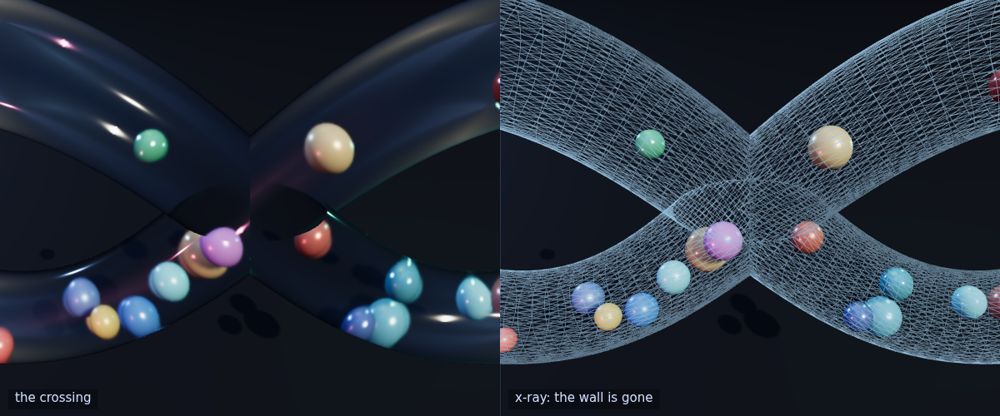
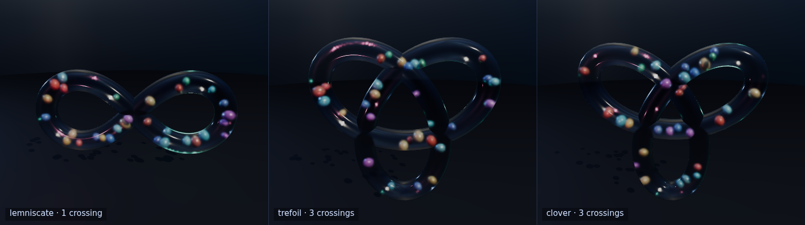
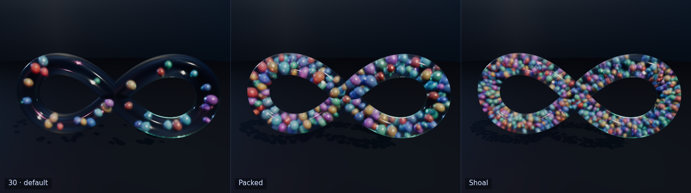

# Infinity Spheres ∞

[](https://github.com/Danielededo/infinity-spheres/actions/workflows/ci.yml)
[](https://github.com/Danielededo/infinity-spheres/actions/workflows/deploy.yml)
[](LICENSE)
[](https://threejs.org/)

A [Three.js](https://threejs.org/) scene in a **single `index.html`**: a closed glass tube swept along
a self-intersecting curve, with coloured marbles loose inside it. They fly freely in 3D, bounce
elastically off each other and off the inner wall, and pass through the open junctions where the tube
crosses itself.

**▶ Live demo: https://danielededo.github.io/infinity-spheres/**

[](https://danielededo.github.io/infinity-spheres/)

No build step and nothing to install — Three.js comes from a CDN through an `importmap`.

---

## The idea

The tube is the set of all points within `R = 2.4` of the curve. Not a pipe with a wall — a *union of
disks*, which means a marble is inside exactly while its centre is within `R − r` of the **nearest
point on the whole curve**, wherever on the curve that happens to be.

That one definition is the trick. Where the curve crosses itself the union becomes an X-shaped chamber,
and the same containment test that keeps a marble in the tube lets it fly from one branch into the
other with no special case anywhere in the physics. The glass has to be cut away to match, which is a
separate job on the mesh:



Because nothing in the physics knows which curve it is, the spine is switchable at runtime:



| spine | crossings | crossing angle | length | tightest bend |
| --- | --- | --- | --- | --- |
| Lemniscate | 1 | 90° | 104.9 | 2.78 R |
| Trefoil | 3 | 75.6° | 170.2 | 2.78 R |
| Clover | 3 | 86.6° | 155.0 | 1.90 R |

Most curves do not work, for four quite different reasons — see
[How it works → Other spines](docs/engineering.md#other-spines).

## How many marbles

From 2 to about a thousand. The default is 30; **Packed** and **Shoal** under **more** are the two
settings worth starting from.



The ceiling is how many *fit*, not how fast they run: around 210–290 at full size, and a thousand at
half size for 38% of a 60fps frame budget. Draw calls stay at **9** throughout, because the marbles are
one `InstancedMesh`. No marble ever leaves the tube, and energy holds to 0.000000%, at every count.

What kept this at 40 for so long — and why two of the three answers were not what they looked like — is
in [How it works → How many fit](docs/engineering.md#how-many-fit).

## Controls

| Action | Mouse / touch | Keyboard |
| --- | --- | --- |
| Orbit · zoom · pan | drag · scroll or pinch · right-drag or two fingers | — |
| Pause | **Pause** | <kbd>space</kbd> |
| Glass → x-ray → hidden | **Glass** | <kbd>G</kbd> |
| Gravity | **Gravity** | <kbd>V</kbd> |
| Trails | **Trails** | <kbd>T</kbd> |
| Auto-orbit | **Spin** | <kbd>A</kbd> |
| Reset — new colours and velocities | **Reset** | <kbd>R</kbd> |
| Ride the selected marble | **Ride a marble** | <kbd>F</kbd> |
| Quality: high ⇄ fast | **Quality** | <kbd>Q</kbd> |
| Sound | **Sound** | <kbd>S</kbd> |
| Inspect a marble | click it | — |
| Fold the panel away | **▲ / ▼** | <kbd>M</kbd> |
| Show or hide the panel | — | <kbd>H</kbd> |

Four sliders: **Speed** 0 to 3×, **Marbles** 2 to 1000, **Size** 0.5× to 1.4×, **Elastic** 0.8 to 1.
Changing the count or the size rebuilds the marbles; the other two take effect live. The marble slider
is spaced geometrically, so every doubling gets the same width and the default sits mid-track instead
of in the first thirtieth.

Under **more**: six presets, three camera poses, a PNG export, and **Copy link**.

Clicking a marble selects it — the raycast tests only marbles, so you can pick one you can see
*through* the glass — and **Ride a marble** puts the camera behind it, pointed down the tube.

**Sound** is off until you ask for it, and turning it on plays one deliberate two-note tone straight
away — so "it is off", "it is broken" and "nothing loud is happening right now" are three answers rather
than one silence. That tone is held rather than struck, because a collision click is 4 ms long and a
phone speaker can swallow it whole while the browser still reports that audio is playing — and on a
phone the output leaves through a media element rather than straight out of the audio graph, because
that is the route that reaches the speaker. After that,
every click is two marbles meeting. Impacts against the glass are silent — a decision, not a
measurement, and it costs about two thirds of the events at the default count; `SND.wall` is the one word
that brings them back, and [How it works](docs/engineering.md#walls-against-marbles) has the numbers
either way. For the clicks that do sound: the
impulse the solver already computed sets how loud it is, and the marble's radius sets the pitch, because
a sphere's ringing modes go as 1/r. Small marbles tick, large ones knock. It is synthesised, so there
are no audio files — and it is the one control deliberately kept out of the URL hash, so a shared link
can never arrive making noise. [How it works → Sound](docs/engineering.md#sound) has the event-rate
measurements that shaped it.

On a phone the panel is a bottom bar that starts folded, and the camera re-frames itself for a portrait
window. What it does, and what it deliberately does not, is in
[How it works → On a phone](docs/engineering.md#on-a-phone).

**Every control is in the URL hash**, so **Copy link** reproduces a setup exactly: `#n=18&z=1.1&e=0.92&g=1`
is the marble-run preset, `#c=trefoil` picks a spine, `#f=1` arrives already riding. No hash means the
defaults.

## Running it locally

ES modules have to be served over HTTP — opening the file as `file://` breaks the imports:

```bash
git clone https://github.com/danielededo/infinity-spheres.git
cd infinity-spheres
python3 -m http.server 8000     # then open http://localhost:8000
```

An internet connection is needed for the CDN; if it is unreachable the page says so rather than showing
a black screen. To run fully offline, `npm i three@0.169.0` and point the `importmap` at the local copy.

## Tuning

Everything lives in the `CONF` object at the top of the script — marble count and radii, tube radius,
initial speeds, restitution, gravity, tessellation. The spines are in the `CURVES` registry just below;
adding one means adding an entry.

Three constraints worth respecting:

- **`rMax < tubeRadius`**, and keeping `rMax` near half of `R` leaves the marbles room to move across
  the bore instead of queueing along it.
- **`marbles · 2·rMax < spine length`** is what the single-file seeding needs. Above that a packing
  takes over — see [How many fit](docs/engineering.md#how-many-fit).
- Dropping `restitution` below 1 makes the impacts lossy, and the marbles settle.

## Development

No dependencies and no build step. The dev dependencies are only for the measurement harness in
[`bench/`](bench/):

```bash
npm ci
npm run serve        # http://localhost:8000
npm run check        # pinned versions agree, structural tags balance
npm run bench:gates  # physics non-regression gates, ~1 min
npm run bench        # full measurement, writes bench/metrics.json, ~12 min
npm run figures      # re-render the images in docs/
```

`npm run check` and `npm run bench:gates` are what CI runs on every push and pull request. The gates
assert that no marble ever ends a step outside the glass, that energy does not drift at
`restitution: 1`, and that marbles still cross between branches. The render metrics are deliberately
not gated in CI — frame time carries ~27% run-to-run variance on a CPU rasteriser, and the reference
screenshots come from the maintainer's machine rather than the runner — but locally SSIM is exactly 1
at all four poses, which is what makes it worth running there. What that gate can and cannot see is
in [How it works](docs/engineering.md#what-the-visual-gate-does-and-does-not-see).

`npm run figures` is deterministic — same seed, a fixed number of simulation steps, and the page kept
from drawing or stepping anything on its own. Three consecutive runs produce byte-identical files, so a
diff in `docs/` is a real rendering change. The three ways that can go wrong are in
[How it works → Reproducible figures](docs/engineering.md#reproducible-figures).

Three.js is pinned in two places, `index.html`'s importmap and `package.json`'s devDependency; `npm run
check` fails if they drift.

## Going deeper

- **[How it works](docs/engineering.md)** — the spine, the junction trim, the collision solvers, what
  was verified and how, and the measurements behind all of it.
- **[`bench/README.md`](bench/README.md)** — the harness: what each metric means, what it can and
  cannot resolve, and why three.js is pinned.

## Licence

[MIT](LICENSE).
